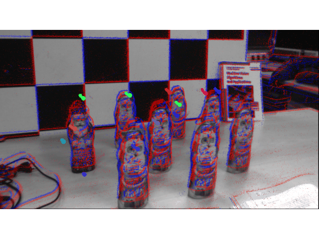
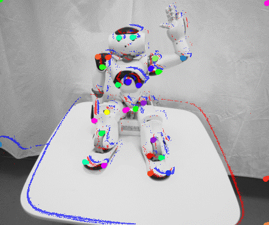
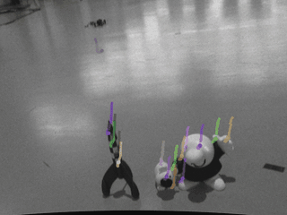
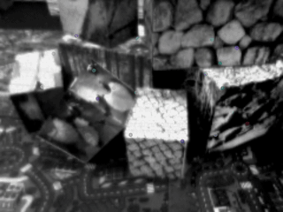

# Enhancing Event-Frame Feature Tracking with Siamese FPN

[](doc/ECCV_2026_Workshop_EBMV_Fotakis_Psarakis.pdf)
[](LICENSE)

This is the official repository for **[Enhancing Event-Frame Feature Tracking with Siamese FPN](doc/ECCV_2026_Workshop_EBMV_Fotakis_Psarakis.pdf)** (ECCV 2026 Workshop on Event-based Machine Vision), by [Andreas Fotakis](mailto:st1084674@ceid.upatras.gr) and [Emmanouil Psarakis](mailto:psarakis@ceid.upatras.gr) (Computer Engineering & Informatics - University of Patras).

This tracker extends [DDFT](https://github.com/uzh-rpg/deep_ev_tracker): features are initialized on a grayscale frame and tracked with events. Separate event/frame Feature Pyramid Networks are replaced by a **shared-weight Siamese FPN**, and training uses a **RAFT-style sequence loss** so that every unrolled displacement is supervised. The result is a lighter model with stronger zero-shot transfer from synthetic MultiFlow data to real event-camera sequences.

## Introduction

In this paper modifications to the pipeline of the first data-driven model based feature tracker for event cameras, are proposed, that improve robustness and accuracy under domain shift. Specifically, the replacement of the separate Feature Pyramid Networks (FPN) for the event and frame branches, with a shared-weight Siamese architecture that learns a common multi-scale descriptor for both modalities, resulting in tighter cross modal alignment in a shared feature space and drastically reducing redundant parameters. Furthermore, a RAFT-style loss is adopted to supervise intermediate displacement predictions and promote more stable optimization. Experimental results show that the proposed method generalizes effectively across datasets and achieves a significant improvement over the initial zero-shot transfer performance from synthetic to real data on the established event-based feature tracking benchmark.

<div align="center">
  <table>
    <tr>
      <td align="center">
        
        <br>TUM-VIE (mocap-6dof)
      </td>
      <td align="center">
        
        <br>VECtor (robot-normal)
      </td>
    </tr>
  </table>
</div>


### Key Features

- Shared-weight Siamese Feature Pyramid Encoder that maps frame patches and event tensors into a common multi-scale descriptor space
- About 20M parameters instead of ~35M in the original DDFT encoder pair, with the same inference compute
- RAFT-style exponentially weighted sequence loss over all unrolled displacements (`γ = 0.9`)
- Frame Attention Module with LayerNorm and dropout for more stable cross-track aggregation
- Trained only on synthetic MultiFlow; evaluated zero-shot on the standard EDS and EC feature-tracking benchmark


### Example Predictions

<div align="center">
  <table>
    <tr>
      <td align="center">
        
        <br>Example 1: Feature Tracking on EDS (peanuts_running)
      </td>
      <td align="center">
        
        <br>Example 2: Feature Tracking on EDS (ziggy_in_the_arena)
      </td>
    </tr>
    <tr>
      <td align="center">
        
        <br>Example 3: Feature Tracking on EC (shapes_6dof)
      </td>
      <td align="center">
        
        <br>Example 4: Feature Tracking on EC (boxes_rotation)
      </td>
    </tr>
  </table>
</div>


## Table of Contents

- [Installation](#installation)
- [Model Selection](#model-selection)
- [Preparing Synthetic Data](#preparing-synthetic-data)
- [Training on Synthetic Data](#training-on-synthetic-data)
- [Preparing Evaluation Data](#preparing-evaluation-data)
- [Inference](#inference)
- [Evaluation](#evaluation)
- [Optional: Pose Fine-Tuning](#optional-pose-fine-tuning)
- [Results](#results)
- [Local Paths to Set](#local-paths-to-set)
- [Acknowledgements](#acknowledgements)
- [Citation](#citation)
- [License](#license)


## Installation

This guide assumes Python 3.9.

1. Clone the repository:

```bash
git clone https://github.com/afotakis/FESiamTrack.git
cd FESiamTrack
```

1. Create an environment:

```bash
conda create -n fesiamese python=3.9
conda activate fesiamese
```

1. Install PyTorch for your CUDA version from the [PyTorch website](https://pytorch.org/get-started/locally/). The paper experiments used PyTorch 1.12 with CUDA 11.3, for example:

```bash
pip install torch==1.12.1+cu113 torchvision==0.13.1+cu113 -f https://download.pytorch.org/whl/torch_stable.html
```

1. Install the remaining dependencies:

```bash
pip install -r requirements_compat.txt
```

If you prefer a fully pinned stack including PyTorch, use `requirements.txt` instead.

Training uses PyTorch, PyTorch Lightning, and Hydra. Pre-processing uses NumPy, OpenCV, h5py, and hdf5plugin. Visualization uses matplotlib, seaborn, and imageio.

## Model Selection

The paper model is the Siamese tracker:


| Config                            | Class                          | Role                                               |
| --------------------------------- | ------------------------------ | -------------------------------------------------- |
| `configs/model/fe_siamtrack.yaml` | `TrackerNetCSiameseSeperateC0` | Proposed Siamese FPN + LayerNorm/Dropout FAM       |
| `configs/model/ddft.yaml`         | `TrackerNetC`                  | Original DDFT baseline (separate event/frame FPNs) |


Set the model in `configs/train_defaults.yaml` or override it on the command line:

```bash
python train.py model=fe_siamtrack
```

Place a trained checkpoint at a path of your choice and pass it as `weights_path` during evaluation. The default event representation is **SBT-Max** (`time_surfaces_v2_5` on real data, `time_surfaces_v2_gpu_5` for GPU-generated MultiFlow tensors). Patch size is 31.

## Preparing Synthetic Data


### Download MultiFlow

Download links:

- [train (1.3 TB)](https://download.ifi.uzh.ch/rpg/multiflow/train.tar)
- [test (258 GB)](https://download.ifi.uzh.ch/rpg/multiflow/test.tar)

If you use MultiFlow, please cite:

```bibtex
@article{Gehrig24tpami,
  author  = {Mathias Gehrig and Manasi Muglikar and Davide Scaramuzza},
  title   = {Dense Continuous-Time Optical Flow from Events and Frames},
  journal = {{IEEE} Trans. Pattern Anal. Mach. Intell. (T-PAMI)},
  year    = {2024}
}
```


### Generate Ground-Truth Tracks and Event Representations

Ground-truth tracks:

```bash
python data_preparation/synthetic/generate_tracks.py \
  <path_to_multiflow_dataset> \
  <path_to_multiflow_extras_dir>
```

SBT-Max event representations (5 bins, `dt` in `{0.01, 0.02}`):

```bash
# CPU
python data_preparation/synthetic/generate_event_representations.py \
  <path_to_multiflow_dataset> \
  <path_to_multiflow_extras_dir> \
  time_surface

# GPU (writes time_surfaces_v2_gpu_5)
python data_preparation/synthetic/generate_event_representations.py \
  <path_to_multiflow_dataset> \
  <path_to_multiflow_extras_dir> \
  time_surface_gpu
```

The extras directory should look like:

```
multiflow_reloaded_extra/
├─ train/
│  └─ sequence_xyz/
│     ├─ events/
│     │  ├─ 0.0100/time_surfaces_v2_5/
│     │  └─ 0.0200/time_surfaces_v2_5/
│     └─ tracks/
│        └─ shitomasi_custom_v5.gt.txt
└─ test/
   └─ ...
```

Point `configs/data/mf.yaml` at these roots (`data_dir`, `extra_dir`).

## Training on Synthetic Data

High-level config: `configs/train_defaults.yaml`.

Configure the dataset in `configs/data/mf.yaml`:

- `track_name` defaults to `shitomasi_custom_v5` in `train_defaults.yaml`
- `n_train: 30000`, `n_val: 1000`
- `augment: True` (geometric augmentations from DDFT)
- `mixed_dt: True` (uses both 10 ms and 20 ms windows)
- `batch_size: 32`

Configure training in `configs/training/supervised_train.yaml` and `configs/optim/adam.yaml`:

- Learning rate `1e-4` (Adam)
- Continual unrolling: `init_unrolls: 4`, then increase after 80k and 120k steps up to `max_unrolls: 23` (paper: 4 → 16 → 24)
- RAFT-style sequence loss with `γ = 0.9` (`utils/losses.py`, used from `models/template.py`)
- Fundamental tracking interval `T = 20 ms`

Then run:

```bash
CUDA_VISIBLE_DEVICES=<gpu_id> python train.py \
  model=fe_siamtrack
```

Hydra instantiates the dataloader and model. PyTorch Lightning runs training and validation. Checkpoints, TensorBoard logs, and visualizations are written under the Hydra run directory (`tb_runs/<model>/version_x/checkpoints/`). Inspect training with:

```bash
tensorboard --logdir <run_dir>/tb_runs
```

At each step, event patches are fetched per track, concatenated, and fed to the network. Predicted displacements are accumulated; the reference frame patch stays fixed.

## Preparing Evaluation Data

Evaluation follows the DDFT protocol on EDS (Prophesee Gen3, 640×480) and EC (DAVIS240C, 240×180).

### Ready-to-use subsequences

To skip raw-data pre-processing, download the prepared evaluation sequences and ground-truth tracks from DDFT:

- [EDS subsequences](https://download.ifi.uzh.ch/rpg/CVPR23_deep_ev_tracker/eds_subseq.zip)
- [EC subsequences](https://download.ifi.uzh.ch/rpg/CVPR23_deep_ev_tracker/ec_subseq.zip)
- [Ground-truth tracks](https://download.ifi.uzh.ch/rpg/CVPR23_deep_ev_tracker/gt_tracks.zip)

Set `gt_path` in `configs/eval_real_defaults.yaml` and the `root_dir` entries in `evaluate_real.py` (`EvalDatasetConfigDict`) to these folders.

The evaluation sequences are:


| Dataset | Sequence                                                                                                                           |
| ------- | ---------------------------------------------------------------------------------------------------------------------------------- |
| EDS     | `peanuts_light_160_386`, `rocket_earth_light_338_438`, `ziggy_in_the_arena_1350_1650`, `peanuts_running_2360_2460`                 |
| EC      | `shapes_translation_8_88`, `shapes_rotation_165_245`, `shapes_6dof_485_565`, `boxes_translation_330_410`, `boxes_rotation_198_278` |


### Prepare sequences from raw data

**EDS.** Download the archive (HDF5 events) from the [EDS page](https://rpg.ifi.uzh.ch/eds.html) for `01_peanuts_light`, `02_rocket_earth_light`, `08_peanuts_running`, and `14_ziggy_in_the_arena`. Rectify, then crop and generate representations:

```bash
python data_preparation/real/eds_rectify_events_and_frames.py <seq> --data_dir <eds_root>
python data_preparation/real/prepare_eds_subseq.py <eds_root> <seq> <start_idx> <end_idx> <dt>
```

**EC.** Download the text archives from the [Event Camera Dataset](https://rpg.ifi.uzh.ch/davis_data.html). Rectify, then crop:

```bash
python data_preparation/real/rectify_ec.py <ec_root> <seq>
python data_preparation/real/prepare_ec_subseq.py <ec_root> <seq> <start_idx> <end_idx>
```

A prepared sequence looks like:

```
sequence_xyz/
├─ events/
│  └─ 0.0100/          # 0.0050 for EDS
│     └─ time_surfaces_v2_5/
│        ├─ 0000000.h5
│        └─ ...
└─ images_corrected/
```


## Inference

`evaluate_real.py` loads `configs/eval_real_defaults.yaml`. Set:

- `weights_path` to a Lightning checkpoint (`.ckpt`)
- `representation` to `time_surfaces_v2_5`
- `gt_path` to the directory of `*.gt.txt` files (same initial corners as other methods)
- `model` to the Siamese config used at training time

```bash
CUDA_VISIBLE_DEVICES=<gpu_id> python evaluate_real.py \
  model=fe_siamtrack \
  weights_path=<path_to_checkpoint.ckpt>
```

The script iterates over `EVAL_DATASETS`, initializes tracks from the ground-truth corners, and writes `<sequence>.txt` (and optional GIFs if `visualize: True`) into the Hydra output directory. The printed `PRED_DIR=` line is the folder to pass to the benchmark tree builder.

Synthetic MultiFlow inference uses the same Hydra config:

```bash
CUDA_VISIBLE_DEVICES=<gpu_id> python evaluate_synthetic.py \
  model=fe_siamtrack \
  weights_path=<path_to_checkpoint.ckpt> \
  representation=time_surfaces_v2_gpu_5
```

Update `MULTIFLOW_DATA_DIR` and `MULTIFLOW_EXTRA_DIR` at the top of `evaluate_synthetic.py` if your data is not in the default locations.

## Evaluation

Build the DDFT-style result tree, then compute Feature Age (FA) and Expected Feature Age (EFA):

```bash
python scripts/make_benchmark_tree.py \
  --gt_dir <path_to_gt_tracks> \
  --pred_dir <PRED_DIR> \
  --results_root <benchmark_root> \
  --method_name attention

RESULTS_ROOT=<benchmark_root> python -m scripts.benchmark
```

The result tree is:

```
<benchmark_root>/
├─ <seq_0>/
│  ├─ gt/<seq_0>.gt.txt
│  └─ attention/<seq_0>.txt
└─ ...
```

Metrics are printed and written to `<benchmark_root>/benchmark_results/benchmarking_results.csv`.

For MultiFlow:

```bash
RESULTS_ROOT=<synthetic_benchmark_root> python -m scripts.benchmark_synthetic
```


## Optional: Pose Fine-Tuning

The paper reports **zero-shot** MultiFlow → real transfer and does not fine-tune on pose. The repository still includes DDFT-style pose supervision if you want to adapt a checkpoint to EC or EDS.

1. Rectify events and frames (same scripts as above).
2. Optionally refine poses with COLMAP (`data_preparation/colmap.py`).
3. Generate `r` event representations between frames:

```bash
python data_preparation/real/prepare_ec_pose_supervision.py
python data_preparation/real/prepare_eds_pose_supervision.py
```

1. Set `data: pose_ec` or `pose_eds` in `configs/train_defaults.yaml`, `pose_mode = True` in `utils/dataset.py`, learning rate `1e-6`, and `checkpoint_path` in `configs/training/pose_finetuning_train_ec.yaml` or `pose_finetuning_train_eds.yaml`. Keep `init_unrolls` equal to `max_unrolls`.


## Results

Zero-shot training on MultiFlow, RAFT loss with `γ = 0.9`. Higher FA / EFA is better.


| Method                   | Input | EDS FA    | EDS EFA   | EC FA     | EC EFA    |
| ------------------------ | ----- | --------- | --------- | --------- | --------- |
| DDFT (zero-shot)         | E+F   | 0.549     | 0.451     | 0.795     | 0.787     |
| DDFT (fine-tuned)        | E+F   | 0.576     | 0.472     | 0.825     | 0.818     |
| FE-TAP                   | E+F   | **0.676** | **0.589** | 0.844     | 0.838     | 
| **Ours (**`γ = 0.9`**)** | E+F   | 0.616     | 0.521     | **0.866** | **0.858** |
| ETAP                     | E     | 0.705     | 0.598     | 0.888     | 0.883     |
| MATE                     | E     | 0.713     | 0.626     | 0.885     | 0.875     |


Among event–frame trackers, the proposed model is strongest on EC and improves substantially over DDFT on both datasets without real-data fine-tuning.

## Local Paths to Set

Machine-specific directories were replaced with `/path/to/...` placeholders. Update these before training or evaluation:


| File | Field | Placeholder | Set to |
| ---- | ----- | ----------- | ------ |
| `configs/data/mf.yaml` | `data_dir` | `/path/to/multiflow` | MultiFlow dataset root |
| `configs/data/mf.yaml` | `extra_dir` | `/path/to/multiflow_reloaded_extra` | Generated tracks and event representations |
| `configs/eval_real_defaults.yaml` | `gt_path` | `/path/to/gt_tracks` | Directory of `*.gt.txt` files |
| `evaluate_real.py` | `EvalDatasetConfigDict` `root_dir` | `/path/to/ec_subseq`, `/path/to/eds_subseq` | Prepared EC and EDS subsequence roots |
| `evaluate_synthetic.py` | `MULTIFLOW_DATA_DIR`, `MULTIFLOW_EXTRA_DIR` | `/path/to/multiflow`, `/path/to/multiflow_reloaded_extra` | Same as `mf.yaml` |
| `data_preparation/real/prepare_eds_subseq.py` | `EDS_SUBSEQ_ROOT` (or pass `output_root`) | `/path/to/eds_subseq` | Where prepared EDS clips are written |
| `configs/data/pose_ec.yaml` | `root_dir` | `/path/to/ec_subseq` | EC root (pose fine-tuning only) |
| `configs/data/pose_eds.yaml` | `root_dir` | `/path/to/eds_subseq` | EDS root (pose fine-tuning only) |


Hydra run directories in `configs/train_defaults.yaml` and `configs/eval_real_defaults.yaml` write under `./outputs/` (gitignored). Optional visualization dumps from `data_preparation/synthetic/generate_event_representations.py` go to `./vis`. Pass `weights_path=<checkpoint.ckpt>` at evaluation time; there is no default checkpoint.

## Acknowledgements

This repository builds on the excellent work of:

- [DDFT](https://github.com/uzh-rpg/deep_ev_tracker) — data-driven event-frame feature tracking, training code, and the EDS/EC evaluation protocol
- [MultiFlow](https://github.com/uzh-rpg/multiflow) — synthetic training data
- Computational resources provided by the Computer Centre of the Department of Computer Engineering and Informatics, University of Patras


## Citation

If you use this code, please cite:

```bibtex
@inproceedings{Fotakis26eccvw,
  author    = {Andreas Fotakis and Emmanouil Psarakis},
  title     = {Enhancing Event-Frame Feature Tracking with Siamese {FPN}},
  booktitle = {ECCV Workshop on Event-based Machine Vision ({EBMV})},
  year      = {2026}
}
```

Please also cite DDFT when using their evaluation protocol, preprocessed sequences, or baseline:

```bibtex
@article{Messikommer25tpami,
  author  = {Nico Messikommer and Carter Fang and Mathias Gehrig and Giovanni Cioffi and Davide Scaramuzza},
  title   = {Data-driven Feature Tracking for Event Cameras with and without Frames},
  journal = {{IEEE} Trans. Pattern Anal. Mach. Intell. (T-PAMI)},
  year    = {2025}
}
```


## License

This project is licensed under the GNU General Public License v3.0 — see the [LICENSE](LICENSE) file for details.